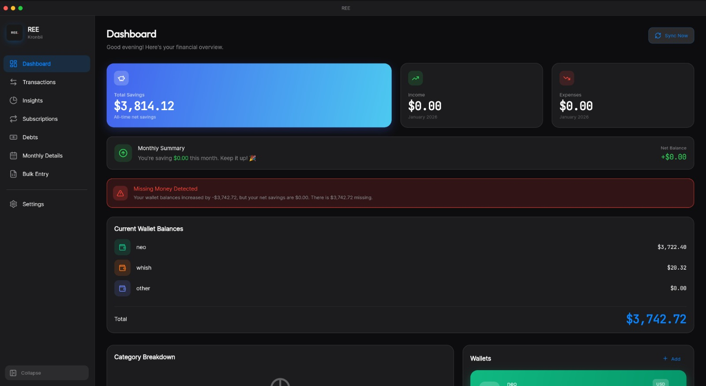
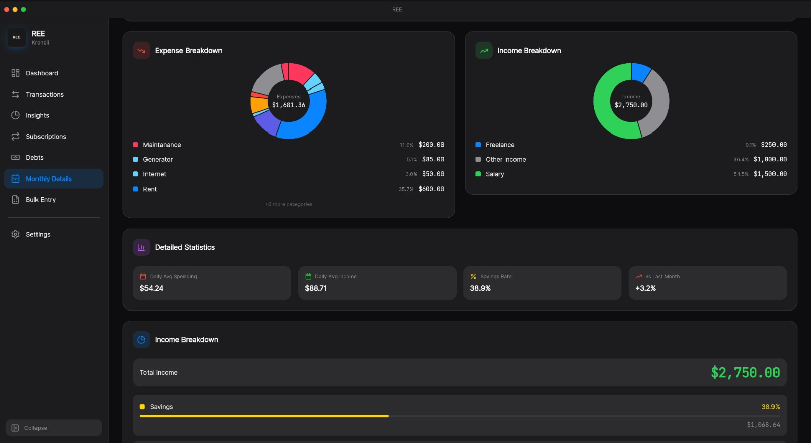

<div align="center">
  
  
  # REE - Personal Finance Tracker
  
  **A beautiful, desktop-first personal finance application with Apple-inspired design**
  
  [](https://flutter.dev)
  [](https://dart.dev)
  [](https://www.linux.org)
  [](LICENSE)
  [](https://riverpod.dev)
</div>

---

<div align="center">
  
  
</div>

## 📖 Table of Contents

- [Features](#-features)
- [Screenshots](#-screenshots--demo)
- [Getting Started](#-getting-started)
- [Architecture](#-architecture)
- [Tech Stack](#-tech-stack)
- [Data Storage](#-data-storage)
- [Building](#-building)
- [Contributing](#-contributing)
- [License](#-license)

---

## ✨ Features

### 💰 Financial Management
- **Multi-Wallet Support** - Track multiple accounts (cash, bank, crypto, etc.) with individual balances
- **Transaction Tracking** - Log income, expenses, and transfers with detailed categorization
- **Bulk Entry Mode** - Add multiple transactions at once with keyboard-optimized workflow
- **Subscription Management** - Track recurring payments, billing cycles, and subscription costs
- **Debt Tracking** - Monitor money you owe and money owed to you with detailed records
- **Savings Goals** - Set and track progress toward financial goals with visual indicators

### 📊 Insights & Analytics
- **Dashboard Overview** - At-a-glance view of your financial health with key metrics
- **Category Breakdown** - Beautiful pie charts showing spending by category
- **Monthly Insights** - Deep dive into any month's finances with detailed analysis
- **Yearly Trends** - Track patterns and trends across the year
- **Spending Analysis** - Understand where your money goes with visual analytics

### 🎨 Premium User Experience
- **Apple-Inspired Design** - Clean, elegant UI with attention to detail and smooth animations
- **Dark & Light Themes** - Easy on the eyes, day or night with automatic system detection
- **Smooth Animations** - Polished interactions throughout using Flutter Animate
- **Desktop Optimized** - Built specifically for keyboard and mouse with efficient workflows
- **Responsive Layout** - Adapts beautifully to different window sizes

### 🛠️ Power Features
- **CSV Import/Export** - Backup and migrate your data easily with preview functionality
- **Custom Categories** - Create, edit, and organize your own income and expense categories
- **Multi-Currency Support** - Display amounts in your preferred currency with formatting
- **Wallet Balance Tracking** - Record and track wallet balances over time
- **Transaction Details** - View and edit detailed transaction information
- **Data Sync** - Supabase integration for cloud synchronization (when configured)

---

## 🚀 Getting Started

### Prerequisites

- **Flutter SDK** 3.10.1 or higher
- **Linux** with desktop support enabled (GTK)
- **Git** for cloning the repository
- **Dart** (included with Flutter)

### Installation

1. **Clone the repository**
   ```bash
   git clone https://github.com/YOUR_USERNAME/personal-finance-tracker.git
   cd personal-finance-tracker
   ```

2. **Install dependencies**
   ```bash
   flutter pub get
   ```

3. **Generate database code** (required for Drift)
   ```bash
   dart run build_runner build --delete-conflicting-outputs
   ```

4. **Run the application**
   ```bash
   flutter run -d linux
   ```

### First Run

On first launch, the app will:
- Create a local database at `~/.local/share/ree/ree.db`
- Set up default categories and settings
- Guide you through creating your first wallet

---

## 🏗️ Architecture

```
lib/
├── app/
│   ├── router/              # GoRouter navigation configuration
│   ├── shell/               # Desktop shell with sidebar navigation
│   │   ├── app_shell.dart   # Main app shell with sidebar
│   │   └── window_title_bar.dart
│   └── theme/               # Premium theming system
│       ├── app_colors.dart
│       ├── app_theme.dart
│       ├── app_typography.dart
│       └── theme_provider.dart
│
├── data/
│   ├── drift/               # SQLite database layer (Drift ORM)
│   │   ├── daos/            # Data Access Objects
│   │   ├── tables/          # Table definitions
│   │   └── database.dart    # Database configuration
│   ├── providers/           # Riverpod providers
│   │   ├── database_provider.dart
│   │   └── currency_provider.dart
│   ├── services/            # Business logic services
│   │   ├── csv_service.dart
│   │   └── currency_formatter.dart
│   └── sync/                # Cloud sync (Supabase)
│       └── sync_service.dart
│
└── presentation/
    ├── screens/             # App screens
    │   ├── dashboard/       # Main dashboard
    │   ├── transactions/    # Transaction list and management
    │   ├── insights/        # Financial insights and analytics
    │   ├── monthly_insights/ # Monthly breakdown
    │   ├── bulk_entry/      # Bulk transaction entry
    │   ├── subscriptions/   # Subscription management
    │   ├── debts/           # Debt tracking
    │   └── settings/        # App settings and configuration
    └── widgets/             # Reusable UI components
        ├── apple_dropdown.dart
        ├── category_pie_chart.dart
        ├── line_chart_widget.dart
        └── stat_card.dart
```

### Design Patterns

- **State Management**: Riverpod for reactive state management
- **Architecture**: Clean architecture with separation of concerns
- **Database**: Drift (SQLite) for local data persistence
- **Navigation**: GoRouter for declarative routing
- **Theming**: Centralized theme system with dark/light mode support

---

## 🛠️ Tech Stack

**Framework & Language:** Flutter 3.10+ • Dart 3.10+  
**State Management:** Riverpod  
**Local Database:** Drift (SQLite)  
**Navigation:** GoRouter  
**Charts:** FL Chart  
**Icons:** Lucide Icons  
**Animations:** Flutter Animate  
**Typography:** Google Fonts  
**File Operations:** File Picker  
**Window Management:** Window Manager  
**Cloud Sync:** Supabase

### Key Dependencies

- `flutter_riverpod` - State management
- `drift` - Type-safe SQLite ORM
- `go_router` - Navigation
- `fl_chart` - Charts and graphs
- `supabase_flutter` - Cloud sync
- `csv` - CSV parsing
- `intl` - Internationalization
- `uuid` - Unique ID generation

---

## 💾 Data Storage

### Development Mode
When running with `flutter run`, a test database is used:
```
.test_data/ree_test.db  (inside the project directory)
```
This ensures your real financial data is never affected during development.

### Production Mode
The AppImage and release builds use:
```
~/.local/share/ree/ree.db
```
This follows the XDG Base Directory Specification for Linux applications.

### Backup
- Database backups are stored in `~/.local/share/ree/backups/`
- Automatic backups are created before updates (when using safe update script)
- Manual backups can be created via the restore script

---

## 🔨 Building

### Building AppImage

#### Safe Update (Recommended for Production)

To safely update an existing installation while preserving your database:

```bash
bash scripts/safe_update_appimage.sh
```

This script will:
- ✅ Backup your production database automatically
- ✅ Backup the existing AppImage
- ✅ Build and install the new AppImage
- ✅ Verify database integrity
- ✅ Keep the last 5 backups for rollback

#### Manual Build

To build the AppImage manually (for development):

```bash
bash scripts/build_appimage.sh
```

The AppImage will be built to `build/REE-1.0.0-x86_64.AppImage`.

#### Restoring Database

If you need to restore your database from a backup:

```bash
bash scripts/restore_database.sh
```

This will list all available backups and let you choose which one to restore.

### Building Release

For a standard Flutter release build:

```bash
flutter build linux --release
```

The build output will be in `build/linux/x64/release/bundle/`.

---

## 🤝 Contributing

Contributions are welcome! Please feel free to submit a Pull Request.

### How to Contribute

1. **Fork the repository**
2. **Create your feature branch** (`git checkout -b feature/amazing-feature`)
3. **Make your changes** following the existing code style
4. **Run tests** (if applicable)
5. **Commit your changes** (`git commit -m 'Add some amazing feature'`)
6. **Push to the branch** (`git push origin feature/amazing-feature`)
7. **Open a Pull Request**

### Code Style

- Follow Dart/Flutter style guidelines
- Use `dart format` before committing
- Run `dart analyze` to check for issues
- Write meaningful commit messages

---

## 📄 License

This project is licensed under the MIT License - see the [LICENSE](LICENSE) file for details.

```
MIT License

Copyright (c) 2025 Kronbii

Permission is hereby granted, free of charge, to any person obtaining a copy
of this software and associated documentation files (the "Software"), to deal
in the Software without restriction...
```

---

## 🙏 Acknowledgments

- **Design Inspiration** - Apple's iOS/macOS design language
- **Flutter Team** - Excellent desktop support and tooling
- **Lucide** - Beautiful icon set ([lucide.dev](https://lucide.dev/))
- **Drift Team** - Powerful type-safe database ORM
- **Riverpod Team** - Modern state management solution

---

## 📧 Contact & Support

- **Issues**: [GitHub Issues](https://github.com/YOUR_USERNAME/personal-finance-tracker/issues)
- **Discussions**: [GitHub Discussions](https://github.com/YOUR_USERNAME/personal-finance-tracker/discussions)

---

<div align="center">
  <sub>Built with ❤️ using Flutter</sub>
  <br>
  <sub>Made by <a href="https://github.com/YOUR_USERNAME">Kronbii</a></sub>
</div>
